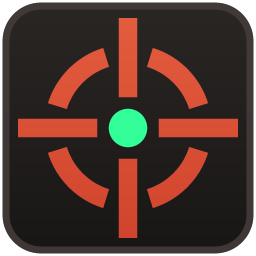
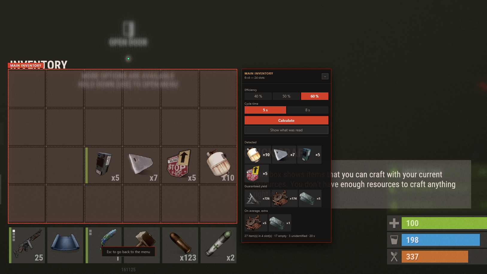

<div align="center">



# Rust Overlay

**An external overlay for [Rust](https://rust.facepunch.com): a configurable aim dot, and a
recycler calculator that reads your inventory straight off the screen.**

[Install](#install) · [Usage guide](docs/USAGE.md) · [How it works](docs/HOW-IT-WORKS.md) · [Building](docs/BUILDING.md)

</div>

---

## What it does

- **Aim dot** — a dot, cross or circle at the centre of the screen. Shape, size, thickness,
  colour, opacity, outline, and a manual offset for when your viewport is not where the
  screen's centre is.
- **Recycler calculator** — point it at your inventory, backpack or an open container, and it
  tells you what recycling the whole lot returns: which items, how much scrap, how long it
  takes. Efficiency (40 / 50 / 60 %) and cycle time (5 / 8 s) are set per zone.
- **Crafting tree** — from the item card Rust shows for the selected item: what it is crafted
  from, and every recipe it is an ingredient for, both navigable.



## The rule this project is built on: no contact with the game

The overlay is a transparent always-on-top Windows window, plus screenshots taken through the
operating system's own capture API. **No DLL injection, no DirectX hooks, no reading the game's
memory.** Nothing is written to the game, and nothing attaches to `RustClient.exe`.

That is what keeps it on the right side of EasyAntiCheat, and Facepunch explicitly permits
third-party crosshairs on exactly that condition. The rule is not negotiable: any optimisation
that would require touching the game process is rejected on principle.

One practical consequence: Rust must not run in *exclusive* fullscreen, which owns the display
surface and forbids anything being composited over it. In practice the game is already
borderless-windowed even with "fullscreen" ticked; if the overlay never appears, force
`-window-mode borderless` in the Steam launch options.

> **Use at your own risk.** This is not affiliated with or endorsed by Facepunch Studios.
> Overlays are permitted, but you are responsible for what you run alongside the game.

## Install

> **Alpha.** It works, and it has been measured rather than guessed at, but it has been used
> by one person on one screen. Expect to recalibrate, and expect the odd item to be read wrong
> — the debug panel exists precisely so that costs you a click.

Grab the latest build from the [Releases](../../releases) page:

- `RustOverlay-x.y.z-setup.exe` — installer, adds a Start-menu shortcut
- `RustOverlay-x.y.z-portable.exe` — single file, run it from anywhere

Windows will warn you that the binary is unsigned (code-signing certificates cost money and
this project has none). Your antivirus may do the same — see
[Troubleshooting](docs/USAGE.md#troubleshooting).

There is nothing else to install. The app finds Rust on its own to read item icons from your
own game files.

## First run, in one minute

1. Launch Rust, then launch the overlay. Nothing appears on screen — that is normal; the icon
   in the notification area, next to the clock, is what tells you it is running.
2. Press **F9** in game. The menu appears; the game keeps every click and key until it does.
3. Open **Settings** and set `graphics.uiscale` to match the value in your F1 console — the
   inventory grid moves when that changes, so the app has to know it.
4. Open your inventory in game, press F9, then **Zone calibration → Main inventory**, and drag
   a rectangle around the slot grid. Adjust the columns and rows with the arrow keys until the
   overlaid grid lines up with the game's slots. `Enter` saves.
5. Press F9 → **Recycler output**. Each calibrated zone gets its own card. Hit **Calculate**.

The full walkthrough, with screenshots, is in the [usage guide](docs/USAGE.md).

## Keys

| Key | What it does |
| --- | --- |
| `F9` | Open the menu (configurable) |
| `Esc` | Close the overlay entirely, from anywhere |
| `Tab` | Close the overlay, the way it closes the inventory in game |
| `↑` `↓` | Move through the menu |
| `←` `→` | Adjust the selected value |
| `Enter` | Select |

## How good is the reading?

Item icons are matched by fingerprint, not by OCR: the game draws the exact PNG that ships in
its own `Bundles/items/` folder, so a slot can be compared against the whole index directly.
Measured on rendered slots at the size the game actually draws them, **80 % of slots are
identified outright and 85 % have the right item among the three candidates** the debug panel
offers, where one click corrects the slot and recomputes the total.

Anything the app is not confident about is reported as unidentified rather than guessed — a
wrong item silently corrupts the total, a rejected one costs a click.

The numbers, the recycler formula and the whole pipeline are documented in
[How it works](docs/HOW-IT-WORKS.md).

## Building from source

```bash
npm install
npm start        # run it
npm run dist     # build the Windows binaries into dist/
```

Details, including how to regenerate the item database from your own game install, are in
[Building](docs/BUILDING.md).

## Status

- [x] Click-through, always-on-top overlay window with a configurable global hotkey
- [x] Aim dot with full styling and manual centring
- [x] Item database and icon fingerprints built from the local game install
- [x] Zone calibration, stored per resolution/uiscale profile
- [x] Recycler HUD: every zone at once, efficiency and cycle time per zone
- [x] Slot recognition, stack-count reading, one-click correction
- [x] Recipes and recycler yields extracted from the game's own bundles — 996 items
- [x] Crafting tree, in both directions, navigable
- [x] Shown only while the game's window is in front
- [ ] Rust Breeder module

## Licence

MIT — see [LICENSE](LICENSE).
