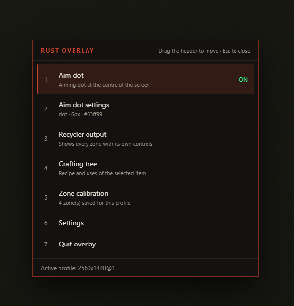
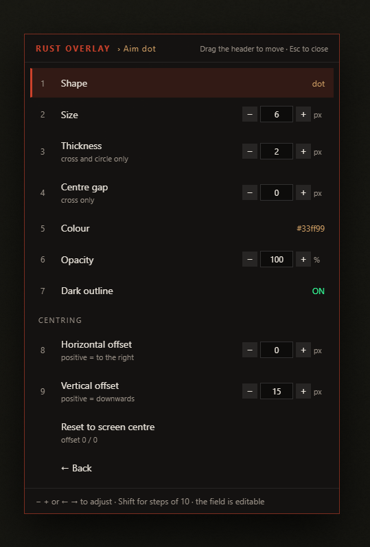
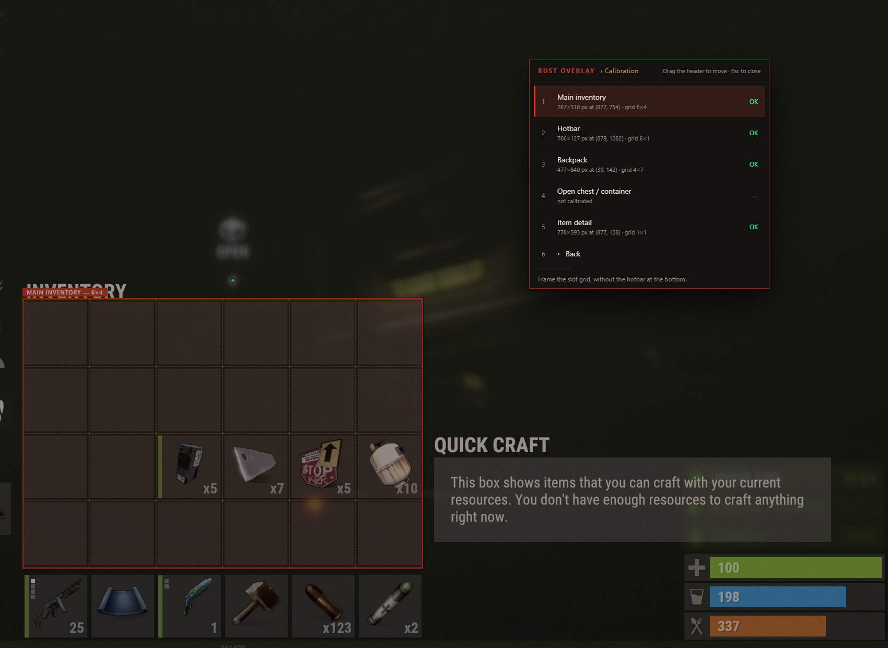
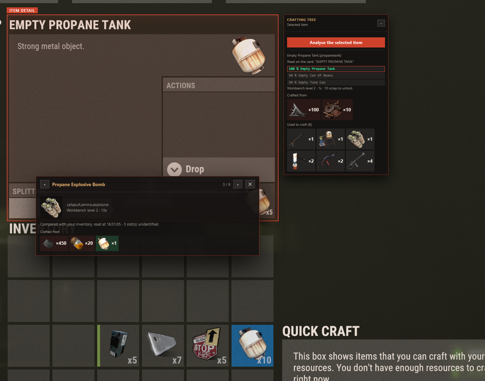

# Usage guide

Everything the overlay does, and how to set it up. If you only read one section, make it
[Calibrating the zones](#calibrating-the-zones) — nothing else works until that is right.

- [Starting up](#starting-up)
- [The menu](#the-menu)
- [Aim dot](#aim-dot)
- [Calibrating the zones](#calibrating-the-zones)
- [Recycler calculator](#recycler-calculator)
- [Crafting tree](#crafting-tree)
- [Settings](#settings)
  - [Tuning recognition](#tuning-recognition)
- [Where your settings live](#where-your-settings-live)
- [Troubleshooting](#troubleshooting)

## Starting up

Run the app. **Nothing appears on screen** — that is correct. The window is transparent, has no
border, and stays out of the taskbar; until you press the hotkey there is nothing to see and
every click and keystroke goes to the game.

What tells you it is running is the **icon in the notification area**, bottom right next to the
clock. Right-click it for the essentials without opening the menu:

- **Open menu** — the same thing the hotkey does, useful if another application has claimed it
- **Aim dot** and **Show only over Rust** — the two toggles you change most
- **Active window** — a readout, not a button: the title of whatever is in front right now,
  and whether the app counts it as the game. This is the fastest answer to "why is the overlay
  showing / not showing".
- **Open settings folder** — where `config.json`, `logs/` and `captures/` live
- **Open log file** — everything the app printed this session
- **Quit Rust Overlay**

Double-clicking the icon opens the menu.

Running from source, a console window also prints a banner (a packaged build has none):

```
  ╔══════════════════════════════════════════════════════╗
  ║  RUST OVERLAY — running                              ║
  ╚══════════════════════════════════════════════════════╝

  Press F9 to open the menu.

  Screen     : 2560x1440
  Profile    : 2560x1440@1
  Config     : C:\Users\you\AppData\Roaming\rust-overlay\config.json
  Shown      : only while the "Rust" window is in front
```

By default the overlay only shows itself while Rust's window is in front, so the aim dot does
not end up sitting on top of your browser. Every time the active window changes, the console
prints what it saw:

```
[focus] front window: "Rust" → the game
[focus] front window: "Chrome" → not the game
```

That line is also the answer if the overlay never appears: it gives you the exact window title
to put in **Settings → Show only over Rust**.

## The menu

`F9` opens it. Move with `↑` `↓`, select with `Enter`, adjust values with `←` `→` (hold
`Shift` for steps of ten), and **`Esc` closes the overlay outright** from wherever you are —
use the `← Back` row to step up one level.

Drag the header to move the panel; its position is remembered.



## Aim dot

**Aim dot** switches it on; **Aim dot settings** styles it: shape (dot, cross, circle), size,
thickness, centre gap, colour, opacity and a dark outline that keeps it readable against snow
and sand.

The centre of your screen is not always the centre of the game's viewport — a windowed Rust
sits below its title bar, and a resolution or DPI mismatch shifts things further. No detection
is reliable enough to trust here, so **Horizontal / Vertical offset** are manual. Set them once
against a weapon's own sights and they stay right.



## Calibrating the zones

The app has to be told where the inventory grid is on *your* screen. That depends on your
resolution **and** on Rust's `graphics.uiscale`, so calibrations are saved per profile, keyed
`<width>x<height>@<uiscale>`. Change either and you calibrate once more; change back and your
old profile returns.

**Before anything else**, set `graphics.uiscale` in **Settings** to the value your F1 console
reports. Getting this wrong does not produce a small error — it puts the grid somewhere else
entirely.

There are four zones:

| Zone | What to frame |
| --- | --- |
| **Main inventory** | the 6×4 slot grid, without the hotbar underneath |
| **Hotbar** | the bottom row of six slots |
| **Backpack** | the backpack grid — not the character model next to it |
| **Open chest / container** | the slot grid of an open container |
| **Item detail** | the whole item card, name included |

To calibrate one:

1. **Open the relevant screen in Rust first** — the inventory, the chest, the item card. The
   app draws over what is on screen; it cannot frame a grid that is not being displayed.
2. Press `F9` → **Zone calibration** → pick the zone.
3. **Drag a rectangle** around the slot grid. Aim for the outer edge of the slots themselves,
   not the panel border around them.
4. A grid is drawn over your rectangle. Adjust it until each cell sits on one game slot:
   `←` `→` change the number of columns, `↑` `↓` the number of rows.
5. `Enter` saves, `Esc` cancels. Drag again at any time to start over.



A few things that make the difference between 60 % and 95 % recognition:

- **Frame the slots, not the panel.** A rectangle a few pixels too large is fine; one that
  includes the panel's title bar is not, because every cell then straddles two slots.
- **The grid overlay is the ground truth.** If its lines fall between the game's slots, the
  count of columns or rows is wrong — nudge it rather than redrawing.
- **Item detail is different.** It is a single cell, and it should frame the *whole* card
  including the item's name. The name is what identifies the item there; the icon is not used.

## Recycler calculator

`F9` → **Recycler output**. The menu disappears and every calibrated zone is outlined, each
with its own card:

- **Efficiency** — 40 %, 50 % or 60 %. These are the only values the game has: 40 % is a
  safe-zone recycler, 60 % a monument one.
- **Cycle time** — 5 s or 8 s, again the only two the game uses.
- **Calculate** — takes one screenshot, reads the zone, and reports.

**The overlay vanishes for a moment when you press it.** That is deliberate, not a glitch: it
has to get its own cards and zone outlines out of the frame before photographing the screen,
or it reads its own panels instead of your inventory. It comes back as soon as the shot is
taken, with a spinner while the slots are being matched.

The result is grouped:

- **Detected** — what was recognised, with quantities. Click any of these to open its crafting
  tree.
- **Guaranteed yield** — what you get for certain.
- **On average, extra** — the fractional part, which is a chance per item rather than a
  promise.
- **No known recipe** — items the game has no blueprint for; they recycle into nothing the app
  can predict.

**Show what was read** opens the debug panel: every occupied slot, the exact pixels that were
measured, the strip the quantity reader was given, and the three nearest items with their
distances. **Clicking one of the three corrects that slot and recomputes the total** — no new
screenshot needed. This is the intended workflow for the handful of slots the matcher is not
sure about, not a failure mode.

`Esc` closes the HUD and goes back to the menu; `Tab` closes the overlay outright, the way it
closes the inventory in game.


Every calculation also writes a full account to `logs/`, with the exact screenshot it was made
from in `captures/`. If a result looks wrong, that pair is what to look at — and what to attach
to a bug report. On an installed build both folders live next to your settings, under
`%APPDATA%\rust-overlay\`; running from source they are in the project directory.

## Crafting tree

`F9` → **Crafting tree**, with an item selected in Rust so its detail card is on screen. The
app reads the item's **name** off the card and looks it up, which is far more reliable than
matching a thumbnail: a name only has to be recognisable, because it is matched against 1243
known names and the nearest one wins.

You get what it is crafted from, and every recipe it goes into. Click any item to open a
centred panel on *its* tree; `‹` `›` or `←` `→` walk through its siblings — the other
ingredients of that recipe, or the other recipes using that item. Click deeper and the arrows
follow you down. `Esc` closes the panel without leaving the HUD.

If the name comes out garbled, the card shows what it read and the three closest names, one
click each.

### What you already have

Ingredients are outlined against your **main inventory**:

| Outline | Meaning |
| --- | --- |
| green | you have enough |
| orange | you have some, but not enough |
| red | you have none |

Hovering a chip gives the exact figures — *you have 40 of 100*.

The reading comes from the same screenshot that identified the item card, so it is as current
as the card itself, and the panel says when it was taken. A recycler calculation on the main
inventory also refreshes it. If the main inventory zone is not calibrated there is nothing to
compare against and no outlines are drawn — the panel says so rather than showing everything
as missing.

Bear in mind these outlines inherit the accuracy of slot recognition: an unidentified slot is
inventory the app cannot see, and the panel reports how many there were.



## Settings

| Setting | What it is for |
| --- | --- |
| **Open key** | The global hotkey. Select it, then press the key you want. |
| **Show only over Rust** | Hide the overlay unless the game's window is in front. The line underneath shows the title of whatever is currently in front, and the title being looked for. |
| **graphics.uiscale** | Must match the game exactly. Half of the calibration profile key. |
| **Slot inset** | How much is trimmed from each side of a cell before reading it. See below. |
| **Recognition tolerance** | How far a match may be before the slot is called unidentified. See below. |

### Tuning recognition

The two defaults — **18 %** and **22** — were measured on real captures rather than picked as
round numbers, and most people never need to touch them. Change them only if the debug panel
says something is wrong, and change one at a time: press **Calculate** again on the same
screen after each change, so you are comparing like with like.

**Slot inset** is how much of each cell is thrown away before reading it, as a fraction of the
cell. It exists because a cell is not an icon: it also holds the slot's border, and sometimes
a green durability bar down the left edge.

- *Too low* — borders and that green bar end up in the crop. The symptom is specific: items
  with durability read badly while everything else is fine. At 14 % an electric fuse ranked
  64th purely because of its condition bar; at 18 % it came first.
- *Too high* — the icon itself is cut, and everything degrades at once.
- *How to tell*: open **Show what was read** and look at the crops. You want the icon, framed
  loosely, and nothing else. If you can see a frame edge or a coloured strip, raise it. If the
  icon touches the crop edges, lower it.

**Recognition tolerance** is the distance past which a match is refused rather than reported.
On real captures a correct match sits at distance 3.5 in the median, but reaches 20.6 in one
case in a hundred — while a wrong match is typically around 13. The two overlap, which is why
this number cannot separate them on its own, and why the app also requires the best match to
lead the runner-up by a clear margin.

- *Lower* — fewer wrong items, more slots reported unidentified.
- *Higher* — fewer unidentified slots, more wrong items in your totals.
- Below about 20 you start refusing slots the app had actually got right. Above about 25 the
  guard stops doing much.

The debug panel prints both numbers for every slot: `fuse @ 3.4 lead 3.36` means it was
matched at distance 3.4 and beat the second candidate by more than three times that distance.
A slot rejected for being *ambiguous* rather than *too far* is one the tolerance would not have
saved — it is the lead that refused it, and raising the tolerance will not bring it back.

Remember that a rejected slot costs one click in the debug panel, while a wrong one silently
corrupts the total. That is the trade the defaults are set for.

## Where your settings live

```
%APPDATA%\rust-overlay\
  config.json     zones, aim-dot styling, hotkey, panel position
  overlay.log     everything the app printed this session
  logs/           one report per calculation
  captures/       the screenshot each report was made from
```

The tray menu's **Open settings folder** takes you straight there. Deleting `config.json`
resets everything; keeping a copy is enough to move your calibration to another machine with
the same screen.

## Troubleshooting

**The overlay never appears at all.** Right-click the tray icon and read the **Active window**
line. If it names the window you are looking at but does not say *(the game)*, the title being
matched is wrong — put the one it shows into **Settings → Show only over Rust**. If it says
*cannot be read*, the app has no way to know which window is in front; it then stays visible
permanently, and **Open log file** says why.

**The overlay stays visible when you alt-tab away.** It means the app cannot tell which window
is in front, and falls back to showing itself always rather than hiding forever. The tray's
**Active window** line will say *cannot be read*, and the log will name the step that failed:
the binding could not be loaded, `user32.dll` could not be opened, or the prototypes were
rejected. The first is usually an antivirus quarantining a native module — an exclusion on the
install folder fixes it.

**The overlay does not appear over the game, but does over the desktop.** Rust is in exclusive
fullscreen. Add `-window-mode borderless` to the Steam launch options.

**Your antivirus flags the app.** The binaries are unsigned, and heuristics dislike that. If it
quarantines the executable, add an exclusion for the install folder. If it blocks the part that
reads which window is in front, the overlay simply stays visible all the time and says so in
the console — nothing else breaks.

**Recognition is wrong across the board.** Almost always calibration. Open the debug panel: if
the crops show slot borders, half an icon, or pieces of two slots, the rectangle or the
column/row count is off. Check `graphics.uiscale` too — the profile key in the console banner
must match the screen you are actually playing on.

**Quantities read as 1.** The debug panel shows the exact strip fed to the reader. If the strip
does not contain the number, the zone is off; if it does and the read still fails, open an
issue with the log and capture from `logs/` and `captures/`.

**The result is right but the totals look odd.** Items with no blueprint recycle into nothing
predictable and are listed under *No known recipe* rather than silently counted as zero.
